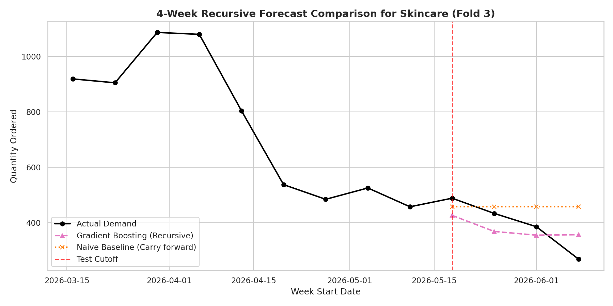
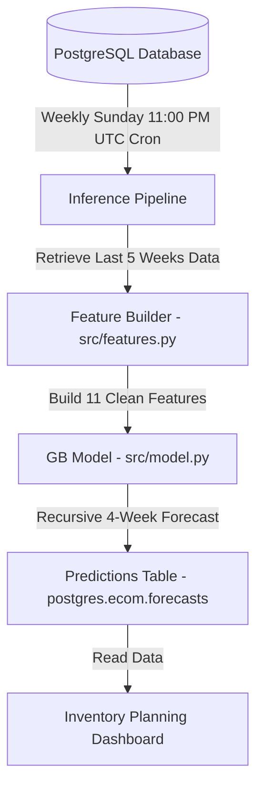

# 📈 E-Commerce Demand Forecasting & Inventory Optimization

**Author:** Anuj Saini  
**Repository:** `https://github.com/anujhsrsaini/demand-forecasting-ml`  
**Tech Stack:** Python, PostgreSQL, Scikit-Learn, SQLAlchemy, Pandas, NumPy, Matplotlib, Seaborn  

---

## 📋 Executive Project Summary

This project translates a vague business request ("*how do we prevent stock-outs and over-ordering?*") into a mathematically rigorous, production-ready machine learning forecasting pipeline. 

### Core Project Dimensions

| Project Dimension | Technical Specification | Business & Engineering Rationale |
| :--- | :--- | :--- |
| **Business Objective** | Prevent item stock-outs and minimize capital lockup in excess warehouse inventory. | Directly improves capital efficiency, warehouse utilization, and customer retention. |
| **ML Task Type** | Category-level weekly demand forecasting (multi-step recursive regression). | Aggregating sparse SKU transactions (12,077 SKUs) into 14 dense, forecastable time series. |
| **Target Variable** | Sum of quantity ordered (`qty`). | Quantity dictates physical storage space and purchase units, making it superior to sales revenue. |
| **Forecast Horizon** | 4 weeks ahead ($t+1$ to $t+4$). | Aligns with standard supplier replenishment lead times, providing actionable lead time. |
| **Primary Metric** | Weighted Mean Absolute Percentage Error (WMAPE). | Business-interpretable percentage; robust to zero values; weights errors by sales volume. |
| **Secondary Metric** | Root Mean Squared Error (RMSE). | Penalizes large outlier errors quadratically, signaling critical stock-out risks. |
| **Final Model** | Gradient Boosting Regressor (Mean WMAPE: **16.14%**). | Achieved a **15.54% relative error reduction (lift)** over the Naive Baseline. |
| **Data Constraints** | 13 weeks of history (106,205 units sold). | Extremely short history prevents learning annual seasonality (holiday peaks, summer spikes). |

---

## 📊 Key Visualization: Recursive Forecast vs. Naive Baseline

Below is the recursive forecasting performance of the Gradient Boosting Regressor on the test fold for the **Skincare** category, compared against the Naive Baseline (which carries forward the last known week's actuals):



---

## 📂 Repository Structure

The project is structured to maintain a clear boundary between interactive exploration and reusable source code:

| Directory / File | Description | Key Deliverables & Contents |
| :--- | :--- | :--- |
| 📁 [**`notebooks/`**](notebooks/) | Jupyter Notebooks (Sequential) | • [`01_explore.ipynb`](notebooks/01_explore.ipynb): EDA, overall trend decay, category correlation.<br>• [`02_features.ipynb`](notebooks/02_features.ipynb): Feature pipeline validation & leakage checks.<br>• [`03_models.ipynb`](notebooks/03_models.ipynb): Time-series CV, recursive model training & evaluation. |
| 📁 [**`findings/`**](findings/) | Executive Briefs & Reports | • [`00_executive_summary.md`](findings/00_executive_summary.md): 3-takeaway summary with exact metrics.<br>• [`01_problem_framing.md`](findings/01_problem_framing.md): Business-to-ML translation & metric rationales.<br>• [`02_features.md`](findings/02_features.md): Rationale behind features & temporal hygiene rules.<br>• [`03_model_comparison.md`](findings/03_model_comparison.md): Cross-validation results & failure mode diagnosis.<br>• [`04_production_plan.md`](findings/04_production_plan.md): Operational architecture, drift thresholds & alerts. |
| 📁 [**`src/`**](src/) | Reusable Production Code | • [`features.py`](src/features.py): Encapsulates feature building functions to ensure identical feature mapping during training and batch inference. |
| 📄 **`requirements.txt`** | Dependency File | Lists exact python packages required to run the pipeline. |

---

## 🛠️ Feature Engineering & Strict Temporal Hygiene

To prevent data leakage—where future target information accidentally bleeds into training features—we implemented strict **temporal hygiene** rules in [src/features.py](src/features.py). Every feature for week $W$ is computed using only data from week $W-1$ or earlier.

### Feature Specification Matrix

We engineered **11 key features** across 5 distinct groups:

| Feature Group | Features | Purpose & Rationale | Leakage Prevention Mechanism |
| :--- | :--- | :--- | :--- |
| **Autoregressive Lags** | `qty_lag_1` to `qty_lag_4` | Captures short-term demand inertia and recent weekly momentum. | Shifted target series by 1 week (`shift(1)`) prior to lag generation. |
| **Rolling Statistics** | `qty_roll_mean_2`, `qty_roll_std_2`<br>`qty_roll_mean_4`, `qty_roll_std_4` | Moving averages smooth out weekly noise to isolate local trends. Moving standard deviations capture demand volatility to size safety stock. | Target series is shifted by 1 week *before* calculating rolling aggregates. |
| **Lagged Pricing** | `price_lag_1` | Captures price elasticity of demand (recent price average for the category). | Shifted average category price by 1 week (`shift(1)`). |
| **Temporal Index** | `time_idx` | Linear week counter. Vital for capturing the overall downward trend in sales. | Independent calendar feature; contains no target information. |
| **Target Encoding** | `category_expanding_mean` | Encodes category identities into a single column by mapping baseline volumes. | Calculated as an expanding window mean *after* shifting the target series. |

---

## 🔬 Model Evaluation & Cross-Validation Results

Models were evaluated using **3-Fold Expanding Window Time-Series Cross-Validation** to respect chronological order. Evaluated over a 4-week forecast horizon using a **recursive forecasting pipeline** (predictions fed back as lag inputs):

| Model | Fold 1 WMAPE | Fold 2 WMAPE | Fold 3 WMAPE | Mean WMAPE | Std Dev |
| :--- | :---: | :---: | :---: | :---: | :---: |
| **Naive Baseline** | 12.80% | 18.10% | 26.42% | **19.11%** | 5.60% |
| **Linear Regression** | 106.20% | 60.53% | 44.55% | **70.43%** | 26.12% |
| **Random Forest** | 15.53% | 14.55% | 24.68% | **18.25%** | 4.56% |
| **Gradient Boosting** | **15.54%** | **12.56%** | **20.32%** | **16.14%** | 6.47% |

### Key Model Insights
*   **The Linear Regression Collapse:** While Linear Regression achieved a low training error (~7.2%), it collapsed in recursive evaluation (**70.43% WMAPE**). With short training histories, the coefficients were unstable, and negative lag weights caused predictions to oscillate and diverge.
*   **Gradient Boosting Lift:** The Gradient Boosting Regressor performed best, achieving a **16.14% WMAPE** (a **15.54% relative lift** over the Naive Baseline). Tree ensembles naturally constrain predictions to the range of training data, preventing feedback divergence.
*   **Feature Importance Drivers:** Recent demand volume (`qty_roll_mean_2` at **46.2%** importance) and global trend decay (`time_idx` at **30.6%**) account for **76.8%** of Gradient Boosting's predictive power.

---

## 🚀 Production Deployment & Monitoring Plan

Even though this is a portfolio repository, the architecture is designed to support a production environment:



*   **Cadence:** Batch inference runs **every Sunday at 11:00 PM UTC** (once previous-week transaction actuals are finalized).
*   **Monitoring Alerts:**
    *   *Warning threshold:* If WMAPE exceeds **25%** in a week, trigger a Slack notification for manual review.
    *   *Critical threshold:* If WMAPE exceeds **35%**, open a Jira ticket and fall back to the Naive Lag-1 baseline to protect warehouse ordering.
*   **Drift Detection:** Kolmogorov-Smirnov (KS) tests are run weekly on numerical features to flag feature drift (alerting if p-value is **< 0.05**).
*   **Retraining:** The model is retrained **quarterly** (every 13 weeks) on the entire accumulated history. Ad-hoc retraining triggers if the critical WMAPE threshold is breached for two consecutive weeks.

---

## 💻 How to Reproduce

1.  **Clone the repository:**
    ```bash
    git clone https://github.com/anujhsrsaini/demand-forecasting-ml.git
    cd demand-forecasting-ml
    ```
2.  **Set up the environment:**
    ```bash
    python3 -m venv venv
    source venv/bin/activate
    pip install -r requirements.txt
    ```
3.  **Configure credentials:**
    Create a `.env` file in the root directory and add your database credentials:
    ```text
    Host=your-database-host-url
    Port=5432
    Database=postgres
    Schema=ecom
    Username=your-read-only-username
    Password=your-read-only-password
    ```
4.  **Run the notebooks:**
    Execute the notebooks sequentially via `jupyter nbconvert --execute --inplace notebooks/*.ipynb` or open them in Jupyter.

---

## 🗺️ What I'd Do Next (Future Roadmap)

*   **Hierarchical Forecasting Reconciliation (MinT):** Implement the **Minimum Trace (MinT)** reconciliation algorithm to combine category-level and SKU-level forecasts, producing coherent predictions across all levels of the inventory tree while minimizing total forecast variance.
*   **Product Metadata Embeddings for Cold-Starts:** Solve the cold-start problem for new items by mapping product descriptions and tags into vector embeddings (using TF-IDF or Sentence-BERT) to identify similar products and copy their early-stage demand distributions.
