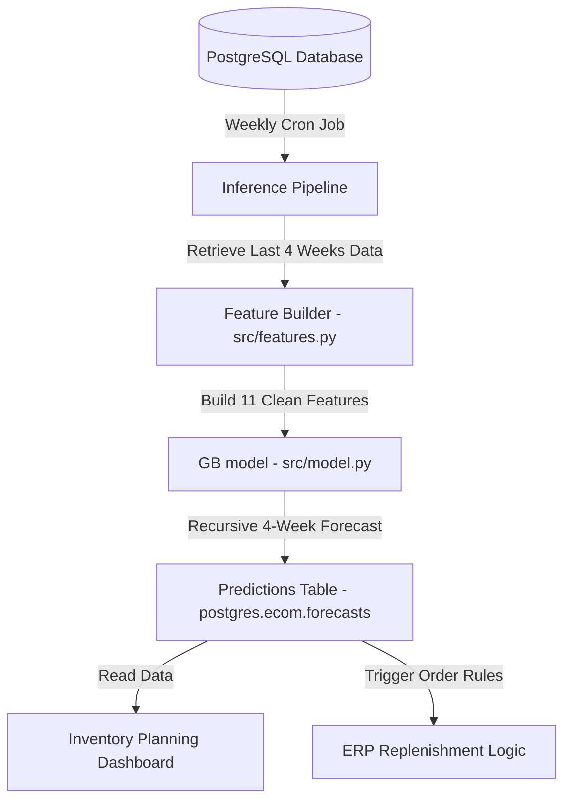

# Production Deployment & Monitoring Plan

**Prepared for:** Operations Director  
**Prepared by:** Anuj Saini, Lead Data Analyst  
**Date:** July 14, 2026  

This plan outlines the operational architecture for deploying the weekly category-level demand forecasting model (Gradient Boosting Regressor) into production. 

### 1. Data Flow Architecture
The model will run on a weekly batch inference cycle. The data flow architecture is described in the diagram below:

### 2. Operational Cadence & Inference Pipeline
*   **Inference Frequency:** The batch inference job runs **every Sunday at 11:00 PM UTC**. This timing ensures that all transactions from the preceding week are finalized and processed.
*   **Forecast Window:** At each run, the pipeline generates predictions for weeks $t+1, t+2, t+3, t+4$ relative to the current week $t$.
*   **Execution Flow:**
    1.  A cron-like orchestrator (e.g., Apache Airflow or GitHub Actions) triggers the inference script.
    2.  The script pulls transaction data from `ecom.orders` and `ecom.order_items` for the last 5 weeks (to populate lags and rolling windows).
    3.  The feature pipeline (`src/features.py`) constructs the feature matrix for week $t+1$.
    4.  The model recursively generates forecasts for weeks $t+1$ to $t+4$, writing the outputs to a new schema table: `ecom.forecasts_weekly`.

### 3. Monitoring & Alerting Thresholds
To ensure reliability and detect performance decay, the system will monitor two key indicators:
*   **Feature Drift (KS Test):** Every week, we run a Kolmogorov-Smirnov (KS) test on the distribution of our numerical features (e.g., `qty_roll_mean_2`) between the training window and the latest 2 weeks. An alert is triggered if the p-value is **< 0.05** for more than 3 categories, indicating a significant change in the demand distribution.
*   **Model Accuracy (WMAPE):** When actual sales are finalized for week $t+1$, the orchestrator calculates the WMAPE of the forecast made 1 week prior.
    *   **Warning Threshold:** If WMAPE exceeds **25%** for a single week or **20%** on a 3-week rolling average, a Slack notification is triggered for review.
    *   **Critical Threshold:** If WMAPE exceeds **35%** in a single week, the system automatically opens a Jira ticket, flags the dashboard, and falls back to the Naive Lag-1 baseline to prevent extreme over-ordering.

### 4. Retraining Strategy
Weekly retraining is avoided to prevent forecast instability and high variance. Instead, we establish a **hybrid retraining schedule**:
*   **Scheduled Retraining:** The model is retrained **quarterly** (every 13 weeks) on the entire accumulated history. This ensures that newer baseline levels (like the current downward trend) are incorporated.
*   **Ad-Hoc Trigger:** An automatic retraining run is triggered if the **Critical WMAPE Alert (>35%)** is breached for two consecutive weeks, or if a new product category is introduced into the e-commerce database (requiring cold-start logic).

### 5. Key Failure Modes & Mitigation
*   **Cold Start (New Category):** When a new category is launched, we lack the 4 weeks of history required for lag features.
    *   *Mitigation:* The system defaults to the expanding average of a similar parent category or a proxy value (e.g. 50 units/week) for the first 4 weeks before transitioning to the ML model.
*   **Holiday Calendar Shift:** Major shopping events (e.g., Black Friday, Prime Day) shift dates yearly, which can lead to large timing errors.
    *   *Mitigation:* The feature pipeline includes a calendar-mapped event distance feature that aligns these events dynamically.
